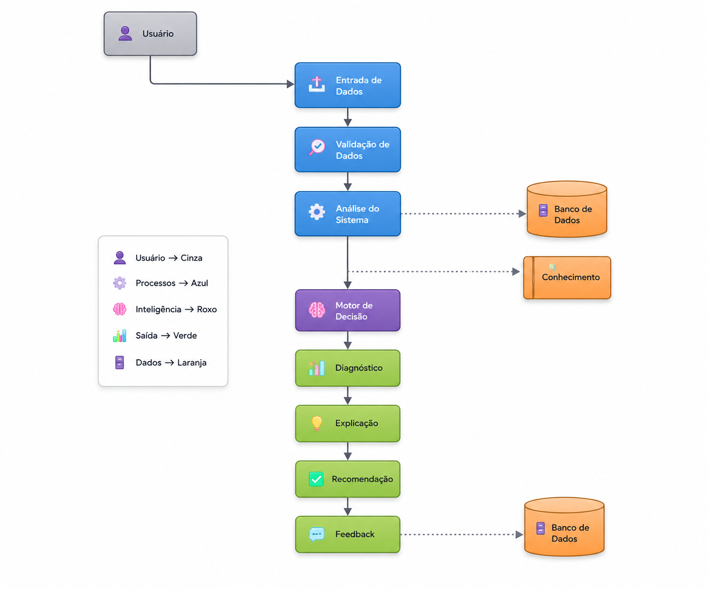
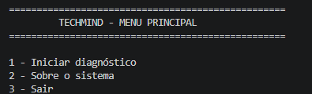
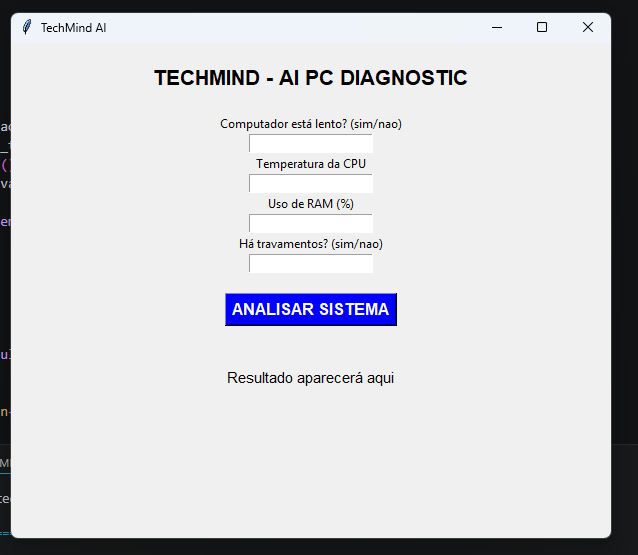
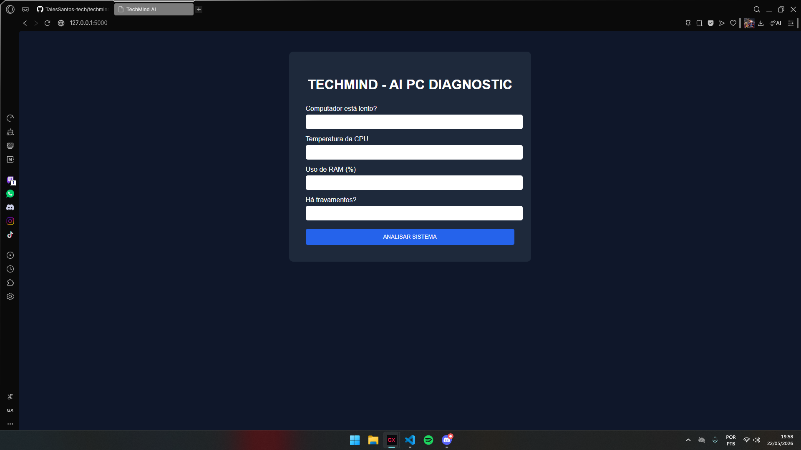
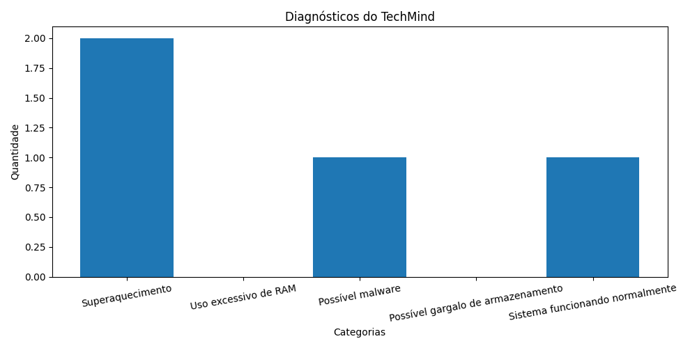
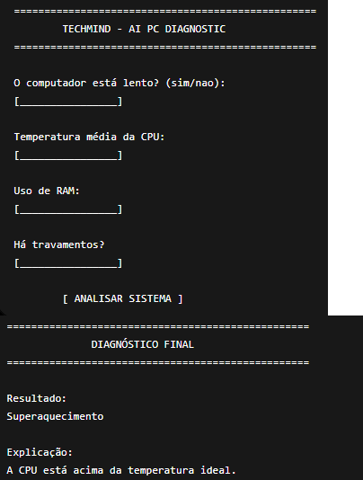

# 🧠 TechMind AI Agent

An intelligent PC diagnostic agent developed in Python using introductory AI Agent concepts, automation workflows, and modern software architecture principles.

---

# 📌 About the Project

TechMind is an intelligent diagnostic system capable of analyzing computer symptoms informed by the user and generating:

- Diagnostic recommendations
- Problem explanations
- Basic troubleshooting suggestions
- Diagnostic history and metrics
- Automated reports and visual analytics

The project was developed for an introductory Artificial Intelligence / Computational Logic course and evolved into a complete portfolio application containing:

- CLI system
- Desktop GUI
- Web version
- Dashboard analytics
- Automated tests
- Database persistence

---

# 🚀 Features

✅ CPU temperature analysis  
✅ RAM usage analysis  
✅ System slowdown detection  
✅ Possible malware indication  
✅ Automatic explanation of diagnosis  
✅ Sequential decision workflow  
✅ Interactive terminal menu  
✅ Colored terminal interface  
✅ Loading simulation  
✅ Diagnostic history system  
✅ Metrics tracking  
✅ Dashboard with charts  
✅ Desktop GUI with Tkinter  
✅ Web version using Flask  
✅ SQLite database integration  
✅ User registration system  
✅ Automated tests with pytest  
✅ Jupyter Notebook documentation  

---

# 🧠 AI Agent Concepts Applied

This project applies several introductory AI Agent patterns:

- Sequential Workflow
- Routing
- Decision Systems
- Tool Use
- Human-in-the-loop
- Modular Architecture
- Persistent State
- Data Logging

---

## AI Agent Patterns Used

| Pattern | Application |
|---|---|
| Sequential Workflow | Sequential diagnostic flow |
| Routing | Different decision paths based on symptoms |
| Tool Use | Functions, metrics, logs and database |
| Human-in-the-loop | User input and validation |

---

# 🏗️ System Architecture



---

# 🖥️ Terminal Interface



---

# 🖼️ Desktop GUI (Tkinter)



---

# 🌐 Web Version (Flask)



---

# 📊 Metrics Dashboard



---

# 🖼️ Mockup



---

# 🏗️ Project Structure

```text
techmind-ai-agent/
│
├── app.py
├── banco.py
├── diagnostico.py
├── interface.py
├── main.py
├── pytest.ini
├── requirements.txt
│
├── database/
│   └── techmind.db
│
├── dashboard/
│   ├── graficos.py
│   └── grafico_metricas.png
│
├── docs/
│   ├── arquitetura.png
│   └── mockup.png
│
├── gui/
│   └── interface_grafica.py
│
├── logs/
│   ├── historico.txt
│   └── metricas.txt
│
├── screenshots/
│   ├── menu.png
│   ├── interface_grafica.png
│   └── web_interface.png
│
├── static/
│   └── style.css
│
├── templates/
│   ├── index.html
│   └── cadastro.html
│
├── testes/
│   ├── __init__.py
│   └── test_diagnostico.py
│
└── techmind_ai_agent.ipynb
```

---

# ⚙️ Technologies Used

- Python
- Flask
- Tkinter
- SQLite
- Matplotlib
- Pytest
- Jupyter Notebook
- HTML5
- CSS3

---

# 🎨 Visual Features

- Colored terminal interface
- Interactive menu system
- Loading simulation
- Dashboard charts
- Desktop graphical interface
- Responsive web layout
- User-friendly workflow

---

# 🧪 Automated Tests

The project includes automated tests using pytest.

Run tests:

```bash
pytest
```

Expected result:

```text
4 passed
```

---

# 📈 Dashboard Analytics

The system automatically generates graphical metrics from stored diagnostics, including:

- Total diagnostics
- Problems detected
- Stable systems
- Diagnostic category distribution

Generate dashboard:

```bash
python dashboard/graficos.py
```

---

# 💾 Database Integration

The project uses SQLite.

Features:
- User registration
- Persistent diagnostic storage
- Structured database architecture

Database file:

```text
database/techmind.db
```

---

# 🌐 Running the Web Version

Install dependencies:

```bash
pip install flask matplotlib colorama pytest
```

Run the application:

```bash
python app.py
```

Open in browser:

```text
http://127.0.0.1:5000
```

---

# 🖥️ Running the Desktop GUI

```bash
python gui/interface_grafica.py
```

---

# ▶️ Running the Terminal Version

```bash
python main.py
```

---

# 🧪 Example Diagnostic Scenario

Input:

```text
Computer slow? sim
CPU temperature: 92
RAM usage: 45
Frequent crashes? nao
```

Output:

```text
Diagnosis:
Superaquecimento

Explanation:
CPU temperature is above the recommended range.
```

---

# 📓 Notebook Version

The project also includes a Jupyter Notebook version for academic presentation and experimentation:

```text
techmind_ai_agent.ipynb
```

The notebook contains:
- Project explanation
- AI concepts
- Code implementation
- Testing scenarios
- Metrics analysis

---

# 📈 Future Improvements

- Real hardware monitoring
- REST API
- Docker support
- Online deployment
- User authentication system
- PDF report export
- Real-time dashboard
- Machine Learning integration
- Linux/Windows hardware integration
- Cloud database support

---

# 👨‍💻 Author

Developed by Tales Santos

---

# ⭐ Project Status

✅ Active Development  
✅ Portfolio Ready  
✅ Academic Ready  
✅ Beginner-Friendly Architecture  
✅ Modular and Scalable System